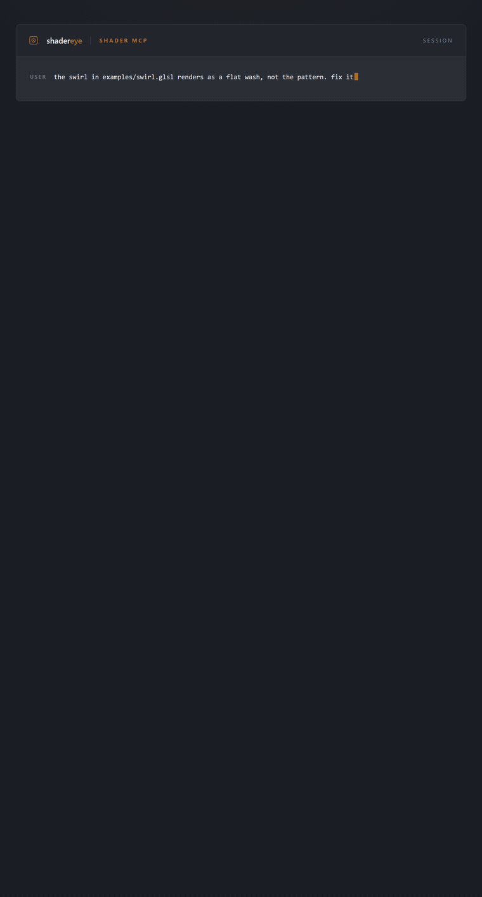
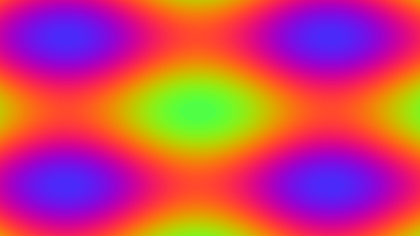
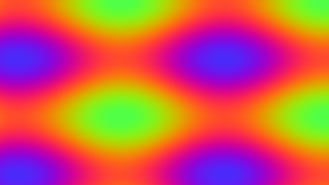
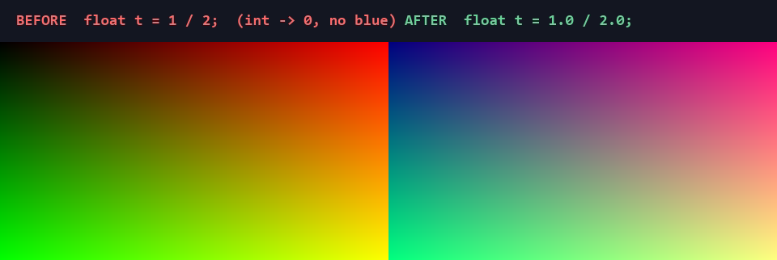

# shadereye

**Give your coding LLM eyes for shaders.**

`shadereye` is a single-binary [MCP](https://modelcontextprotocol.io) server that
lets a coding LLM (Claude Code and peers) compile, render, debug,
browser-execute, test, and look up shaders across GLSL, WGSL, and HLSL.



*Claude renders `examples/raymarch_broken.glsl`, sees the dead blue channel,
looks up the integer-division gotcha, fixes the line, and re-renders — all
through shadereye's MCP tools. ([animation source](media/loop.tape) ·
[recording kit](docs/DEMO.md))*

## The problem

Coding LLMs write shaders effectively blind. They cannot see rendered output,
cannot inspect intermediate values, and have no tight compile/perceive/correct
loop. The result is slow, error-prone shader work that depends on a human to be
the model's eyes. There is no lightweight, LLM-shaped tool that closes this
perception gap and connects the model to existing shader knowledge (Shadertoy,
language references).

`shadereye` closes that loop: the model renders a shader to an image it can
actually view, probes pixels, runs the shader in a real browser GPU pipeline to
read the driver's compile log, and looks up the gotcha that explains what went
wrong — then fixes it and re-renders.

## What it does

Eleven MCP tools spanning perception, debugging aids, the correctness loop,
runtime ground truth, and knowledge connection:

| Tool | Input → Output |
|---|---|
| `validate_shader` | source, lang? → structured errors/warnings (line:col), entry points, detected language |
| `render_shader` | source, lang?, w, h, time → PNG image content block + warnings + backend used |
| `render_animation` | source, time range, frame count → contact-sheet montage PNG |
| `visualize_expression` | source, expression, mapping (grayscale/RG/RGB/normalized/heatmap) → rendered PNG of that expression |
| `probe_pixels` | source, list of coords → exact RGBA floats + zoomed crop PNG |
| `diff_shaders` | A vs B, tolerance → metrics (max/mean abs diff, % pixels over tol) + highlighted diff PNG + pass/fail |
| `translate_shader` | source, from, to → translated source + notes |
| `run_in_browser` | source, w, h, frame count → canvas screenshot PNG + full transcript: console log/warn/error, JS exceptions, WebGL `getShaderInfoLog`/`getProgramInfoLog`/`gl.getError` |
| `shadertoy_get` | id or URL → code + metadata, harness-adapted |
| `shadertoy_search` | query → result list of shader ids |
| `lookup_reference` | query → curated bundled GLSL/WGSL/Shadertoy reference + common-gotcha entries |

## Two render backends

`shadereye` ships two complementary render backends:

- **Native (`wgpu`)** — the fast, deterministic default. Headless offscreen
  render with a **software fallback** (Vulkan software / DX WARP), so it works
  in CI and on machines with no GPU. Always reports which adapter was used.
  Best for tight compile→see→fix loops and golden tests.
- **Browser** — ground truth. Drives a headless **system Chromium** over CDP and
  runs the shader in a real **WebGL2 / GLSL ES 3.00** pipeline that matches
  Shadertoy's actual runtime. Captures the *real* driver output:
  `getShaderInfoLog`, `getProgramInfoLog`, `gl.getError()` codes, every
  `console.*` line, uncaught JS exceptions, plus a canvas screenshot.

naga's static validation (native) and the browser's runtime errors catch
different classes of problems — a shader can pass native validation and still
fail in-browser (e.g. a missing `precision` qualifier).

> The browser backend needs a system Chrome/Chromium. shadereye auto-detects it;
> override with the `SHADEREYE_BROWSER` environment variable.

## Install

From source (installs the `shadereye-mcp` binary from the workspace):

```sh
cargo install --git https://github.com/zajalist/shadereye shadereye-mcp
```

Or download a prebuilt binary for Linux, Windows, or macOS from the
[GitHub Releases](https://github.com/zajalist/shadereye/releases) page.

## Use with Claude Code

Add `shadereye` to your MCP server config:

```json
{
  "mcpServers": {
    "shadereye": {
      "command": "shadereye-mcp",
      "env": { "SHADERTOY_API_KEY": "your-free-key" }
    }
  }
}
```

The `SHADERTOY_API_KEY` is a free key from
[shadertoy.com](https://www.shadertoy.com/) and is only needed for the
`shadertoy_get` / `shadertoy_search` tools — every other tool works without it,
and the Shadertoy tools return a graceful error if the key is absent.

## Example transcript (native): Claude fixes a broken raymarcher

> **User:** Render `examples/raymarch_broken.glsl` and tell me why it looks
> wrong.

**Claude** calls `render_shader` on `examples/raymarch_broken.glsl`:

```glsl
void mainImage(out vec4 fragColor, in vec2 fragCoord) {
    vec2 uv = fragCoord / iResolution.xy;
    float t = 1 / 2;          // BUG: integer division -> 0.0
    fragColor = vec4(uv, t, 1.0);
}
```

The returned PNG is a flat red↔green gradient with **no blue at all** — the
blue channel is dead everywhere. Claude calls
`lookup_reference("integer division")` and gets back the bundled gotcha:

> **integer-division** — In GLSL, `1/2 == 0` (integer division). Use `1.0/2.0`
> for float results.

That explains the dead blue channel: `float t = 1 / 2;` evaluates the
right-hand side as integer division (`0`) before assigning to the float. Claude
edits the line to `float t = 1.0 / 2.0;`, calls `render_shader` again, and the
image now has the expected blue component. Fixed.

## Example transcript (browser): the real WebGL compile log

> **User:** This Shadertoy-style shader renders here but fails when I paste it
> into Shadertoy. Why?

```glsl
out vec4 fragColor;
void main() {
    fragColor = vec4(0.2, 0.6, 0.9, 1.0);
}
```

It passes native validation and renders fine with `render_shader`. Claude calls
`run_in_browser` on it. The structured transcript comes back with
`compiled_ok: false` and the **real** WebGL `getShaderInfoLog` from the
browser's GLSL ES 3.00 compiler:

```
ERROR: 0:2: '' : No precision specified for (float)
```

Claude calls `lookup_reference("precision")` and gets:

> **webgl-precision** — WebGL2/GLSL ES requires an explicit precision qualifier
> (e.g. `precision highp float;`). naga/desktop GLSL does not — shaders that
> work in shadereye native may fail in-browser without it.

Claude prepends `precision highp float;`, re-runs `run_in_browser`, and now
`compiled_ok: true` with a clean screenshot. The native backend never would
have surfaced this — only running it in a real browser GPU pipeline did.

## Tool reference

| Tool | Purpose |
|---|---|
| `validate_shader` | Static compile/validate (GLSL/WGSL/HLSL) via `naga`; structured errors + detected language + entry points. |
| `render_shader` | Render a Shadertoy-style / GLSL / WGSL fragment shader to a PNG. |
| `render_animation` | Render a time range to a contact-sheet montage PNG. |
| `visualize_expression` | Render an arbitrary expression with a chosen mapping (grayscale / RG / RGB / normalized / heatmap). |
| `probe_pixels` | Exact RGBA float values at given coordinates + a zoomed crop PNG. |
| `diff_shaders` | Render two shaders and diff them; metrics + highlighted diff PNG + pass/fail. |
| `translate_shader` | Cross-translate a shader between glsl / wgsl / hlsl / spirv. |
| `run_in_browser` | Execute in headless system Chromium (WebGL2); full console + driver-log transcript + screenshot. |
| `shadertoy_get` | Fetch a Shadertoy shader by id or URL, harness-adapted. |
| `shadertoy_search` | Search Shadertoy for matching shader ids. |
| `lookup_reference` | Offline curated GLSL/WGSL/Shadertoy reference + common gotchas. |

## Gallery

Real output from the bundled examples, rendered through the `shadereye-render`
engine (and a real browser WebGL2 pipeline). Regenerate any of these with the
`dump_frames` example — see [`docs/gallery.md`](docs/gallery.md).

| Asset | What it shows |
|---|---|
|  | [`media/plasma.gif`](media/plasma.gif) — `examples/plasma.glsl` rendered native (`wgpu`), one full `iTime` loop. ([mp4](media/plasma.mp4)) |
|  | [`media/webgl_demo.gif`](media/webgl_demo.gif) — the same plasma in a real **WebGL2 / GLSL ES 3.00** browser pipeline. ([mp4](media/webgl_demo.mp4) · [page](media/webgl_demo.html)) |
|  | [`media/raymarch-fix.png`](media/raymarch-fix.png) — `examples/raymarch_broken.glsl` before/after the integer-division fix: no blue → blue restored. |

See [`docs/DEMO.md`](docs/DEMO.md) for the MCP config, a vetted demo prompt, a
60-second shot list, and recording instructions (asciinema / vhs / OBS).

## Roadmap (post-v1)

- Shadertoy multipass / buffer passes.
- Texture / audio / cubemap iChannels.
- Optional MSL / HLSL target packaging.
- Browser backend: WebGPU / WGSL canvas as support matures; optional Playwright
  driver; interactive watch session that streams console errors live.
- Dedicated `shadereye://reference/...` MCP resource endpoint for browsing the
  bundled reference directly (folded into `lookup_reference` for v1).
- Optional live-docs reference fallback (bundled reference is primary in v1).
- Watch mode / incremental re-render hints.

## License

[MIT](LICENSE) © 2026 zajalist
